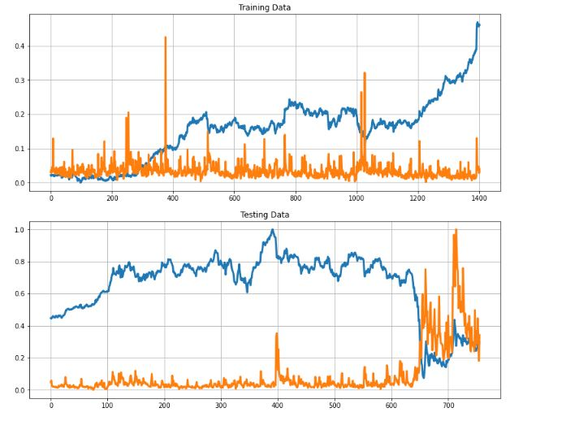

# STONKS

This is a python notebook made on Google Colab that uses Keras to predict the value of the stock specified. 

# DISCLAIMER

DO NOT USE THIS TO PREDICT STOCKS IN THE REAL WORLD. PREDICTING STOCKS IS EXTREMELY DIFFICULT AND AS SUCH CANNOT BE PERFECTLY PREDICTED BY THIS MODEL.

# HOW IT WORKS

It takes in closing values of stocks between 2012 and 2020 from a csv file in the repository. 

Preferably use Google Colab as it won't require you to install libraries.

Download the files (stock.csv, stock_volume.csv) and upload them to your drive.

Mount your drive:

```python
from google.colab import drive
drive.mount('/content/drive')
```


Once your drive is mounted, execute each cell of the notebook.

Alternatively, the code is present in a ".py" file in the repository which you can paste into a single cell in a new notebook to use.

Import Libraries:

```python
import pandas as pd
import plotly.express as px
from copy import copy
from scipy import stats
import matplotlib.pyplot as plt
import numpy as np
import plotly.figure_factory as ff
from sklearn.linear_model import LinearRegression
from sklearn.svm import SVR
from sklearn.model_selection import train_test_split
from sklearn.metrics import r2_score
from tensorflow import keras
```

Now you may begin using the program.

After taking in the values, it formats the values in a way that the LSTM network can interpret it and work upon it.

In the dataset provided , 85 percent of the data starting from fiscal year 2012 is used to train the model and the remaining 15 percent is used to test the model's accuracy.

The notebook generates 3 plots using the Interactive Plot feature available in all notebooks.

The First plot shows the price and volume of the stock in the training data range.

The Second plot shows the price and volume of the stock in the testing data range.

The Third plot shows the price of the stock in both ranges as well as the price predicted by the model.

To add stock data, download the histroical data of the stock from Yahoo FInance as a csv file. Copy the closing value and add it to the stock.csv file. COpy the volume and add it to the stock_volume.csv file in your drive. Also add the name of the stock in the column in which you paste the data.

# WHY LSTM network and not a RNN?

The model used a LSTM network instead of a conventional Recurrent Neural Network as RNNs cannot establish long term dependencies whereas LSTM networks can.

LSTM networks can also overcome the vanishing gradient problem, being:

As more layers using certain activation functions are added to neural networks, the gradients of the loss function approaches zero, making the network hard to train.

LSTMs solve the problem using a unique additive gradient structure that includes direct access to the forget gate's activations, enabling the network to encourage desired behaviour from the error gradient using frequent gates update on every time step of the learning process.

# THE MODEL

The following code snipet describes the structure of the model used in the program.

```python
# The Model
inputs = keras.layers.Input(shape=(X_train.shape[1], X_train.shape[2]))
x = keras.layers.LSTM(150, return_sequences= True)(inputs)
x = keras.layers.Dropout(0.3)(x)
x = keras.layers.LSTM(150, return_sequences=True)(x)
x = keras.layers.Dropout(0.3)(x)
x = keras.layers.LSTM(150)(x)
outputs = keras.layers.Dense(1, activation='linear')(x)

model = keras.Model(inputs=inputs, outputs=outputs)
model.compile(optimizer='adam', loss="mse")
model.summary()
```
# EXAMPLE

First you are given a choice to pick a stock from the given stock.csv file.


Then there are 3 plots. The first plot is a graph showing stock price vs volume for the data in the training range. The Second plot is a graph showing stock price vs volume for the data in the testing range. 



The final plot is the graph for original values and the values predicted by the stock:


# CONTRIBUTION

Anyone is welcome to fork this repository and use as they please.

(READ DISCLAIMER)


# LICENSE 
[](https://opensource.org/licenses/MIT)
